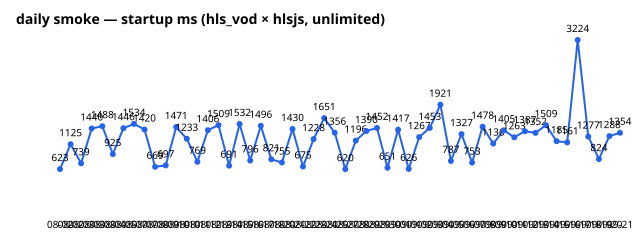

# 일일 스모크 추이

매일 06:00 KST CI가 측정하고 추이를 자동 갱신한다 (smoke.yml의 trend-and-deploy 잡). 로컬 전체 재구축: `npm run trend` (gh CLI 필요).

| date | startup_ms | rebuffer_ratio | error |
|---|---|---|---|
| 2026-08-02 | 623 | 0 | — |
| 2026-08-02 | 1125 | 0 | — |
| 2026-08-03 | 739 | 0 | — |
| 2026-08-03 | 1440 | 0 | — |
| 2026-08-03 | 1488 | 0 | — |
| 2026-08-04 | 925 | 0 | — |
| 2026-08-05 | 1446 | 0 | — |
| 2026-08-07 | 1534 | 0 | — |
| 2026-08-07 | 1420 | 0 | — |
| 2026-08-08 | 669 | 0 | — |
| 2026-08-09 | 697 | 0 | — |
| 2026-08-10 | 1471 | 0 | — |
| 2026-08-10 | 1233 | 0 | — |
| 2026-08-11 | 769 | 0 | — |
| 2026-08-12 | 1406 | 0 | — |
| 2026-08-13 | 1509 | 0 | — |
| 2026-08-14 | 691 | 0 | — |
| 2026-08-15 | 1532 | 0 | — |
| 2026-08-16 | 796 | 0 | — |
| 2026-08-17 | 1496 | 0 | — |
| 2026-08-18 | 821 | 0 | — |
| 2026-08-20 | 755 | 0 | — |
| 2026-08-21 | 1430 | 0 | — |
| 2026-08-22 | 675 | 0 | — |
| 2026-08-23 | 1228 | 0 | — |
| 2026-08-24 | 1651 | 0 | — |
| 2026-08-25 | 1356 | 0 | — |
